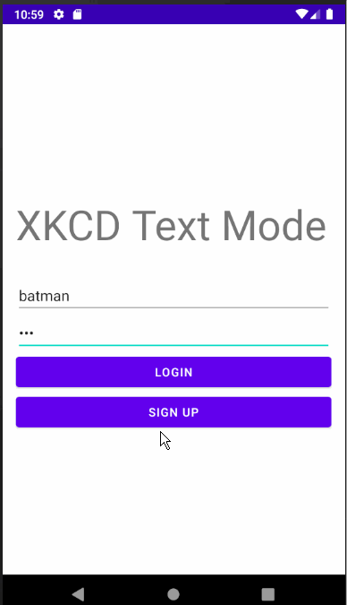

# *XKCD Text Mode*

**XKCD Text Mode** is a XKCD comic viewer that uses the XKCD API to retrieve and view a comic's transcript and image.

Time spent: **8** hours spent in total

### User Stories

- [X] User can sign up to create a new account using Parse authentication.
- [X] User can view a comic's transcript if available.
- [X] User can view the comic image itself
- [X] User can view the last opened comic
- [X] User can mark comics as favourites
- [X] Store history of viewed comics using a RecyclerView
- [X] Store comics marked favorite by the user using a RecyclerView
- [X] Bottom naviagtion to switch between Home view, Favorite comics view and History view
- [X] User can mark/unmark comics as favorites withtin the Favorite and History recycler views
- [ ] Via a progress bar the user can keep track of number of viewed comics and is updated as the user reads new comics

## Video Walkthrough

Here's a walkthrough of implemented user stories:

GIF created with [LiceCap](http://www.cockos.com/licecap/).

### Notes

### Open-source libraries used

- [Android Async HTTP](https://github.com/codepath/CPAsyncHttpClient) - Simple asynchronous HTTP requests with JSON parsing
- [Glide](https://github.com/bumptech/glide) - Image loading and caching library for Android

## License

    Copyright 2021 Mohammed Khan

    Licensed under the Apache License, Version 2.0 (the "License");
    you may not use this file except in compliance with the License.
    You may obtain a copy of the License at

        http://www.apache.org/licenses/LICENSE-2.0

    Unless required by applicable law or agreed to in writing, software
    distributed under the License is distributed on an "AS IS" BASIS,
    WITHOUT WARRANTIES OR CONDITIONS OF ANY KIND, either express or implied.
    See the License for the specific language governing permissions and
    limitations under the License.
